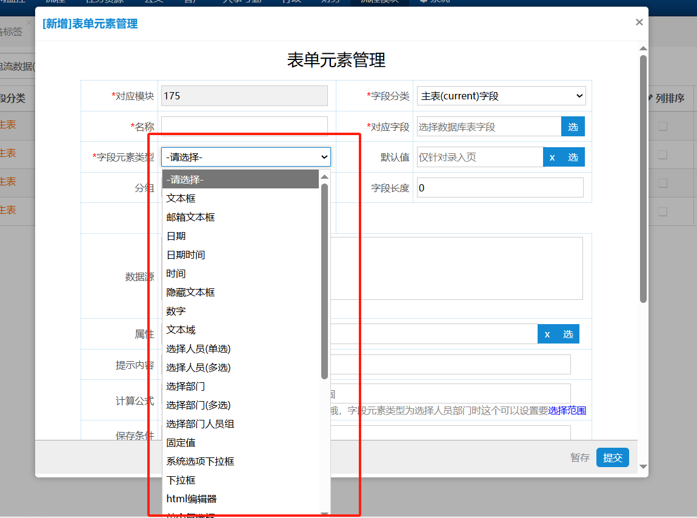
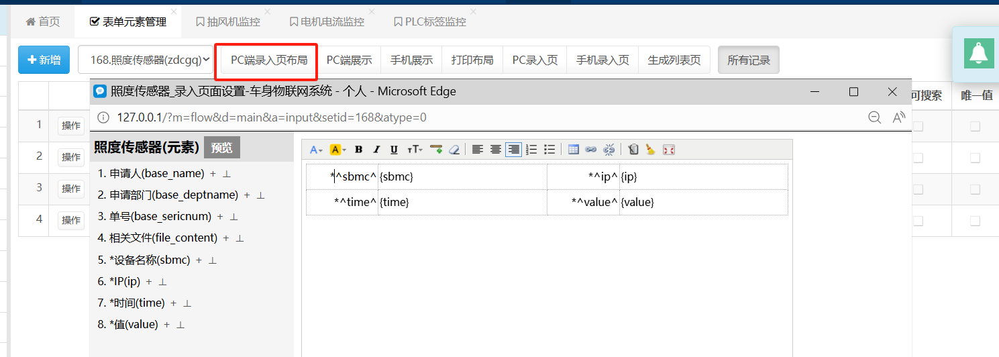
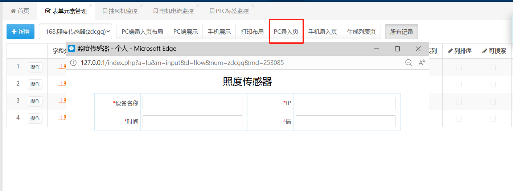
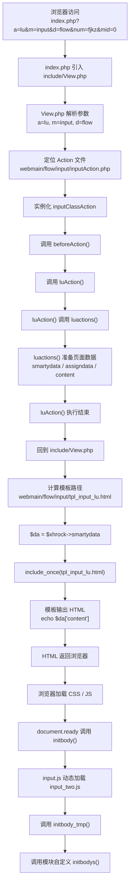

## 录入页

> 自如其名，用于录入数据。
> 
> OA系统数据保存在数据库中，因此本节不仅包括系统和数据库关联内容，还包括录入单据对应的表单的相关方法

### 表单元素管理

> 在创建完**模块**（和数据库相关）之后，我们通常需要为模块添加相关的**字段**（和数据库下的字段相关）

系统默认有N个元素，对应网址[页面元素表单类型的数据源说明_信呼](http://www.rockoa.com/view_element.html)

即对应：

关于字段添加等基本操作在这里就不过多赘述。（2026-5-6）

主要讲解PC端录入页，手机端同理。

布局：设定录入页样式



实际显示录入页样式



### 设计代码文件

录入页布局确认后---->默认生成录入页的静态页面，位于路径**webmain\flow\page**下

对应的录入页js，位于路径**webmain\flow\input\inputjs**下

后端（数据源、添加操作前判断、提交）等方法操作，位于路径**webmain\flow\input**下

例如模块**风机控制**,对应模块名：fjkz

<mark>录入静态页面：</mark>webmain\flow\page\input_fjkz.html（PC端）

webmain\flow\page\view_fjkz.html（手机端）

<mark>录入页js</mark>：webmain\flow\input\inputjs\mode_fjkz.js

<mark>后端操作方法</mark>：webmain\flow\input\mode_fjkzAction.php

### 录入页渲染流程

#### 录入页调用

通过触发`js.winiframe(name, url);`即在框内访问路径url

调用路径同理可以为`a=lu&m=input&d=flow&num=fjkz&mid=0&callback=opegs1778057074494_2280`

这个本质上就是路由，因此又转入了`view.php`文件中。

<mark>View.php</mark>怎么工作可以挑到<mark>框架篇</mark>。要是懒得话直接看本小节的总结

<a href="#render-summary">查看程序执行顺序</a>](#页面渲染顺序总结)


#### 数据准备

openinput('库里库里','fjkz',"99")

para1:标头名

para2：模块名

para3：填写就是编辑对应的id单据，不填则默认添加

新增按钮调用链：

clickwin

openinput

```
        clickwin:function(o1,lx){
            var id=0;
            if(lx==1)id=a.changeid;
            openinput(modename,modenum,id,'opegs{rand}');
    },
```

openxiangs

```
function openxiangs(name, num, id, cbal) {
  if (!id) id = 0;
  if (!cbal) cbal = "";
  var url = "task.php?a=p&num=" + num + "&mid=" + id + "";

  var jg = num.indexOf("?") > -1 ? "&" : "?";
  if (num.indexOf("?") > -1 || num.substr(0, 4) == "http") {
    url = num + "" + jg + "callback=" + cbal + "";
  } else {
    url += "&callback=" + cbal + "";
  }

  js.winiframe(name, url);
  return false;
}
```

js.winiframe(name, url);

总结，对于录入页，对应的url：

`a=lu&m=input&d=flow&num=fjkz&mid=0&callback=opegs1778057074494_2280`

从url分析对应的后端内容，调用

/flow/input/inputAction 下的luAction方法，

这个方法长达250行的废物代码，让ai翻译着看吧。

主要作用：

- 通过html模板文件，渲染录入页网页；（前端网页html）

- 为录入页加载对应的js页面响应方法（前端js）

- 按键动作调用后端对应的接口方法（后端php）---在inputAction文件体现不明显，要看js联系。

#### 数据渲染

```
    $temppath                    = ''.ROOT_PATH.'/'.$p.'/';
    $tplpaths                    = ''.$temppath.''.$d.''.$m.'/';
    $tplname                    = 'tpl_'.$m.'';
    if($a!='default')$tplname  .= '_'.$a.'';
    $tplname                   .= '.'.$xhrock->tpldom.'';//tpldom默认为html
    $mpathname                    = $tplpaths.$tplname;//对应html路径
```

```
 p =webmain
 d = flow
 m = input
 a = lu
 root_path/webmain/flow/tpl_input_lu.html
```

```
if($xhrock->display && ($ajaxbool == 'html' || $xhrock->tpltype=='html' || $ajaxbool == 'false') && $_showbool){
    $xhrock->setHtmlData();//smartydata重载，为下一行代码将da传给前端
    $da = $xhrock->smartydata;//前端data
    foreach($xhrock->assigndata as $_k=>$_v)$$_k=$_v;//把assigndata数组中的元素转换成变量，$_k是键，$_v是值，$da就是smartydata数组
    include_once($mpathname);//渲染页面
    $_showbool = false;
}
```

在View最后，通过include_once($mpathname);渲染页面


<a id="render-summary"></a>

### 页面渲染顺序总结



### 录入页操作

> 主要讲解录入页相关js后再讲解后端php
