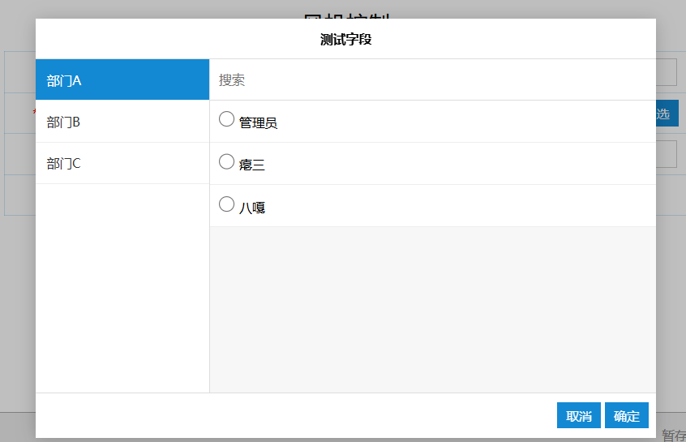
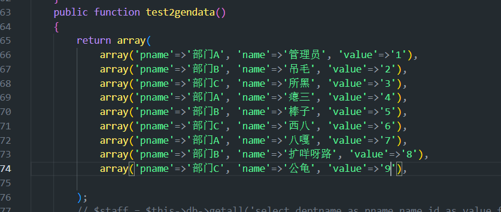

### 示例：添加二级分级管理字段

> 引入：在做PM分配的时候，某段表示每次都要输入框搜索名单，想要**快速找到自己管理班长人员名单**，但班长选择的时候班组人员可能不及时更新就找不到PM实施人。所以增加一个管理字段

效果图：

数据源：

（pname为第一分级，name为第二分级名字，对应的填充id内容为value）

必须严格按照对应**标准键**名

（例如pname改成deptname就无法找到对应部门名单）

#### 修改文件1：input_two.js

#### 修改文件2：inputChajian.php
