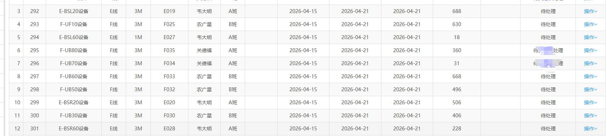
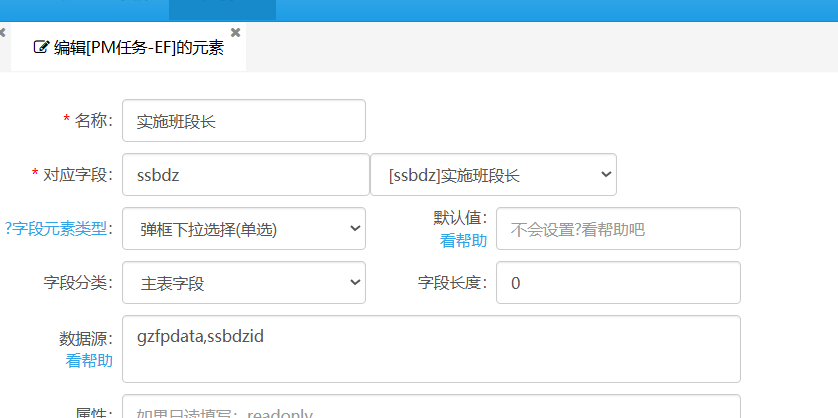
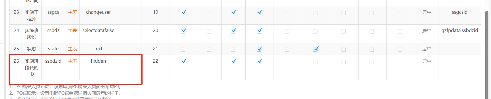
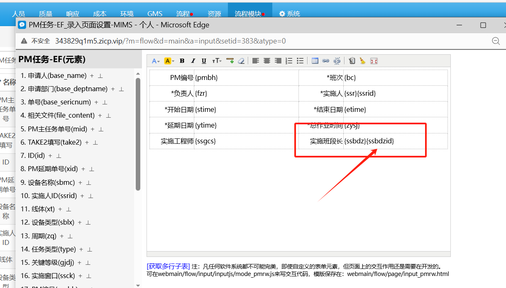
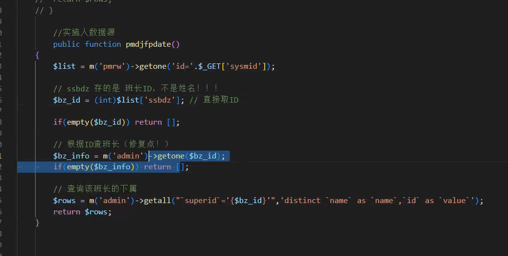
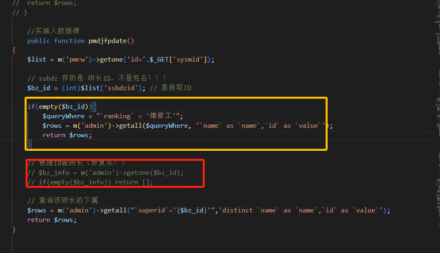

## 数据源

### 静态数据源

> 用法：根据业务添加相应数据，为表单添加数据内容。
> 
> 如选择执行员工（默认条件下选择自己部门下的员工），限制选择范围

### 动态数据源

> 用法：根据表单选择内容类型，在进一步细化选择。
> 
> 如员工中有不同天赋类型选手：睡觉，吃饭，打游戏；
> 
> 表单中选择“打游戏”类型任务时仅仅显示自己部门下天赋点拥有“打游戏”的员工。

### 错误示范

<mark>问题</mark>：id写不进对应字段，无法匹配流程

代码逻辑：

1.通过单据id，获取对应单据的负责人(但是没有用上)

2.编写where条件（筛选班长，变量命名确是工长）

3.然后通过where查询

整体上看来完全没毛，但是id就是写不进

解决方法：

看到数据源配置，数据源为gzfpdata，确实对应了mode里面的方法，

问题点：录入表中没有ssbdzid字段对应的输入栏

措施：

1. 在系统中添加ssbdzid字段，录入列必须是勾选，

2. 录入页中添加对应的ssbdzid字段

解决问题:

段长在选择班长实施pm任务时，就可以讲ssbdzid记录到ssbdzid对应的输入框中，然后保存到数据库中，不然仅仅是将name代入ssbdz字段，value对应ssbdzid无法代入。

问题2：班长选择人员无法加载

代码逻辑：

1.通过单据id，获取对应单据的负责人

2.获得对应单据班段长名字（错误点1.这里是名字，不是id）

3.用名字作为where条件，肯定是查不到的，因此选中这一条无论如何都会返回空

4.及时3不返回空，rows也无法返回数据，因为`$bz_id`是班长的名字，而不是`id`,返回的仍然为空

修改方法，

1。`ssbdz`和`ssbdzid`是段长流程就会赋予的，直接通过`ssbdzid`在admin表中查询对应的下级信息，如果为空才返回空数组（这里也可以进行修改。为什么要返回空数组呢？直接返回维修人员不是更好吗）

2。通过ssbdzid找到上级为对应班长的人员名单，修改后为：

修改后：

橙色部分：当没有ssgdzid（这种情况绝对不会发生），列表为维修工

红色部分注释，不需要，直接通过班长id查找维修工名单。
