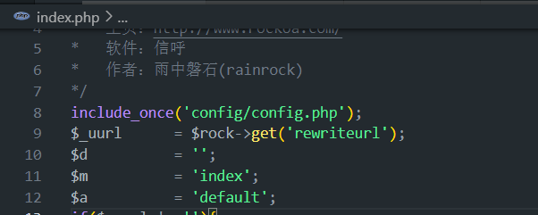
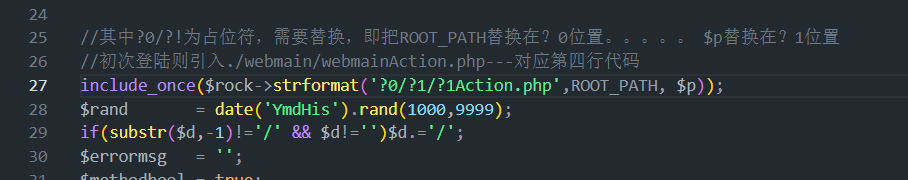
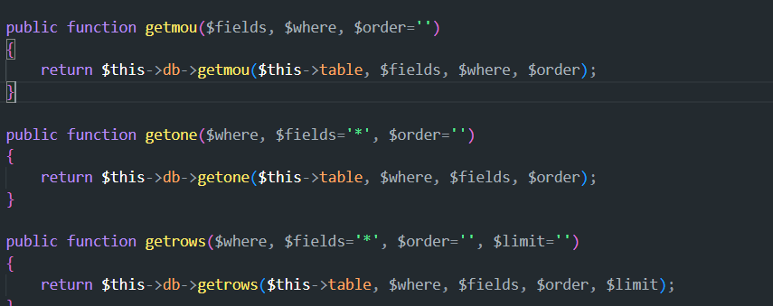
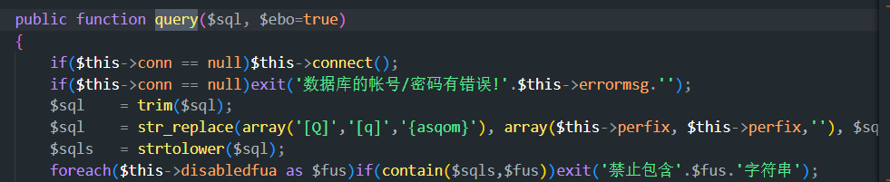

---

---

## 信呼系统小小见解

> 意识到自己即将寻求其他机缘，所以制作该教程，分享下系统的框架学习经验。
> 
> 之前也做了一些工作但是都比较省略，这次打算仔细点，争取能够细致入微；计划在三月底完成。
> 
> md学习网址：[Markdown 在线编辑 - 锤子在线工具](https://www.toolhelper.cn/Code/Markdown)

### 一、系统启动流程

#### 1.启动入口（路由处理入口）

系统使用的是apache？还是nginx？本人使用的是**apache**，nginx也大差不差。

- 通过 WAMP tray（系统托盘）快速打开：
- 右键 Wamp 图标 → Apache → httpd.conf（或 Apache → 配置文件 → httpd.conf）
- 从配置文件中查找 DocumentRoot 和 DirectoryIndex（默认入口文件）
- 

> 可以看到这里的DirectoryIndex 为 DirectoryIndex index.php index.php3 index.html index.htm，一般默认启动html然后才是php

对应启动入口文件路径（相对路径，后文同）**：index.php**


注释是AI生成的，其实看着也大差不差，需要注意的是rewiteurl参数（**get参数**），在框架中基本不会遇到，目测是作者调试的时候使用的，举个例子：`[127.0.0.1](http://127.0.0.1/?rewriteurl=public_print_abc)`，访问该路径，即访问的是：文件**webmain\public\print\printAction.php**下的**abcAction**方法

---

**需要重点注意**：

include_once 和include 的用法，均是在本作用域内引入文件内容。

然后就引入了**View.php**文件了

即可以看作是**文件和文件的连接**。因此可以在View.php（视图代码）中看到直接使用`$d` `$m`  `$a`变量。这三个变量贯穿学习始终，简记成：


`$d`:directory（文件夹）:对应路由文件夹位置

`$m`:modle(模块名)：路由文件夹下的文件夹

`$a`:action（方法）：路由程序名。函数如果是方法就以Action结尾，ajax请求以Ajax结尾。

---

View加载步骤：

1. 加载对应的路由

2. 判断是否登录、数据库加载（webmainAction）

3. 方法引入

4. 网页跳转


接下来的代码就不讲了，但是**十分重要**。还是要学会滴~~

#### 2.模拟页面登录

正常情况下访问页面，都是直接输入页面网址。如本机 127.0.0.1，是没有其他的get请求参数的，即系统的第一层index.php。

系统默认执行




> **注意**：当没有d，只有m的时候，则代表d和m同名字，即访问目录为：ip/index/index目录


初次加载步骤：

1. 进入index路由

2. 判断是否登录（session存在？）

3. 输入账号密码（session不存在）登录或直接进入对应路由（session存在）

4. 登录执行index/default方法，渲染tpl_index.html页面，加载相关js依赖，css样式

5. 加载数据库，渲染导航栏，首页内容渲染等

以上加载都只是简略步骤，细节方面还需要看代码，第4.第5.可参考下二小节(TODO)

> 这几个部分的初始化都是在*View.php*中完成的，所以说index.php/View.php这两个路由跳转文件是很重要，如果想要了解框架，这两个文件就是基础。


#### 3.登录逻辑

上节讲到，登录index后会在view.php和index.php做初始化操作。本节细讲登录逻辑：

在view.php中。默认引入

webmainAction.php（Action方法），这是所有首次登录都会进行的操作，Action方法继承mainAction(Action.php),在Action方法中又有构造函数：

```
	public function __construct()
	{
		$this->rock		= $GLOBALS['rock'];
		$this->smarty	= $GLOBALS['smarty'];
		$this->jm		= c('jm', true);
		$_obj = c('lang');if($_obj!=NULL && method_exists($_obj,'initLang'))$_obj->initLang();
		$this->now		= $this->rock->now();
		$this->date		= $this->rock->date;
		$this->ip		= $this->rock->ip;
		$this->web		= $this->rock->web;
		$this->perfix	= PREFIX;
		$this->display	= true;
		// $this->initMysql();	//空的
		$this->initConstruct();//引入了数据库连接，并实例化了option对象
		$this->initProject();//为空
		$this->initAction();//为空
	}
	
```

其中，

 this->initProject();
 this->initAction都是抽象方法，给子类用的。

##### 3-1 数据库连接

这里主要是调用了initConstruct方法，方法中使用了mysqli驱动

```
	private function initMysqllink()
	{
		$this->db		= import(DB_DRIVE);//import方法在rockFun.php中，用于引入class文件，这里的dirver为mysqli，即引入mysqliClass.php文件，并实例化一个mysqliClass对象
		$GLOBALS['db']	= $this->db;
		include_once(''.ROOT_PATH.'/include/Model.php');
		$this->option	= m('option');
	}
```

> import 的时候就直接创建了对应的对象，**详细请看rockclass对应的import方法**

1. 引入了Model，Model对象本质也是对$this->db的调用，如下图：



2. 每次CURD前都会执行query（R）、tranbegin操作(CUD)，连接数据库，如下图：



在mysqliClass.php文件中,继承了mysqliClass，并且创造了

```
<?php
include_once('mysql.php');
//引入mysql数据库类，使用的都是mysqliClass方法，
class mysqliClass extends mysql{
```


##### 3-2  登录状态检查

> 在登录进入系统菜单页之前，需要进行登录，状态检查逻辑写在*webmainAction.php*中。

因为webmainAction（Action对象）是继承于Action（mainAction）对象的，在mainAction构造时调用了initProject()，可以在webmain\webmainAction.php代码文件中查看对应的函数逻辑：

```
	public function initProject()
	{
		$this->getlogin();
		if($this->rock->get('ajaxbool')=='true')return;
		$this->smartydata['adminid']	= $this->adminid;
		$this->smartydata['adminuser']	= $this->adminuser;
		$this->smartydata['adminname']	= $this->adminname;
		$this->smartydata['logintime']	= $this->getsession('logintime');
		$cenghei	= (int)$this->get('cenghei','0');
		if($cenghei==0)$cenghei = $this->getsession('cenghei','0');
		$this->assign('cenghei', $cenghei);
		$this->rock->savesession(array('cenghei' => $cenghei));
	}
```

具体逻辑还是要看代码，这里就说明加载**步骤**就行：

1. 在进入系统的同时，系统就开启了会话@session_start();（代码在config.php中）

2. 检查是否登录-session内容adminid不为0则代表登录；默认没登录都为0，所以在打开网页时通常会跳转到登录界面。

3. adminid不为0进入菜单页面，为0跳转到登录页面，即在index?m=login

4. 加载html界面引入js,然后再提一嘴，**这个js.js文件也是很重要的，也要学**

```
<script type="text/javascript" src="js/jquery.js"></script>
<script type="text/javascript" src="js/js.js"></script>
<script type="text/javascript" src="js/base64-min.js"></script>
<script type="text/javascript" src="<?=$da['p']?>/<?=$da['d']?><?=$da['m']?>/<?=$da['m']?>script.js"></script>
```

5. 执行初始化函数initbody()，做一些初始化操作；在loginscript.js中，最重要的函数是**loginsubmit**，即验证密码；

6. 通过调用var url = js.getajaxurl("check", "login");这个方法验证用户账号密码合规，这时候就行执行checkAjax，保存对应的session和cookie等信息。

7. 跳转到首页面


#### 4.菜单加载
