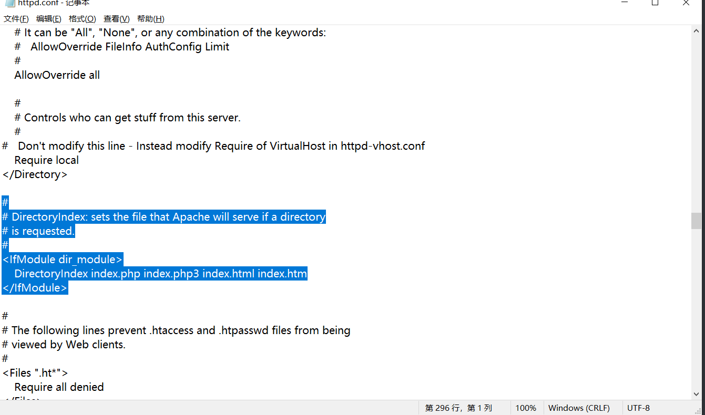
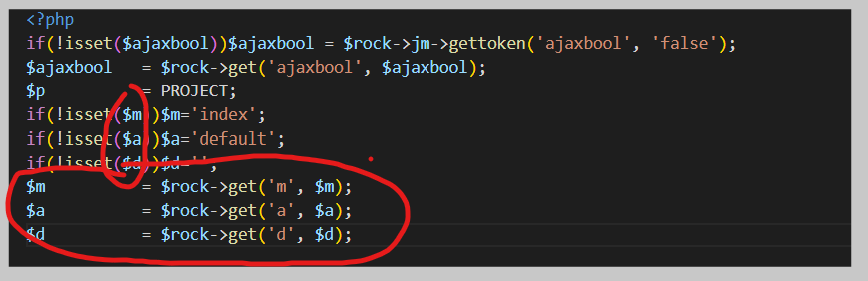

---

---

## 信呼系统小小见解

> 意识到自己即将寻求其他机缘，所以制作该教程，分享下系统的框架学习经验。
> 
> 之前也做了一些工作但是都比较省略，这次打算仔细点，争取能够细致入微；计划在三月底完成。
> 
> md学习网址：[Markdown 在线编辑 - 锤子在线工具](https://www.toolhelper.cn/Code/Markdown)

### 一、系统启动流程

#### 1.启动入口

系统使用的是apache？还是nginx？本人使用的是**apache**，nginx也大差不差。

- 通过 WAMP tray（系统托盘）快速打开：
- 右键 Wamp 图标 → Apache → httpd.conf（或 Apache → 配置文件 → httpd.conf）
- 从配置文件中查找 DocumentRoot 和 DirectoryIndex（默认入口文件）
- 

> 可以看到这里的DirectoryIndex 为 DirectoryIndex index.php index.php3 index.html index.htm，一般默认启动html然后才是php

对应启动入口文件路径（相对路径，后文同）**：index.php**

注释是AI生成的，其实看着也大差不差，需要注意的是rewiteurl参数（**get参数**），在框架中基本不会遇到，目测是作者调试的时候使用的，举个例子：`[127.0.0.1](http://127.0.0.1/?rewriteurl=public_print_abc)`，访问该路径，即访问的是：文件**webmain\public\print\printAction.php**下的**abcAction**方法

---

**需要重点注意**：

include_once 和include 的用法，均是在本作用域内引入文件内容。即可以看作是**文件和文件的连接**。因此可以在View.php（视图代码）中看到直接使用`$d` `$m`  `$a`变量。这三个变量贯穿学习始终，简记成：

`$d`:directory（文件夹）:对应路由文件夹位置

`$m`:modle(模块名)：路由文件夹下的文件夹

`$a`:action（方法）：路由程序名。函数如果是方法就以Action结尾，ajax请求以Ajax结尾。

---

随便更新下，测试测试
