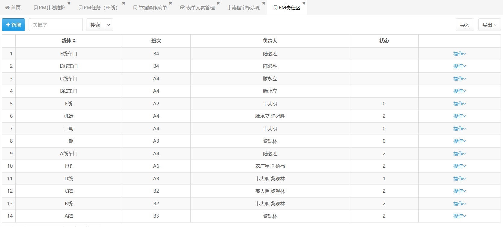
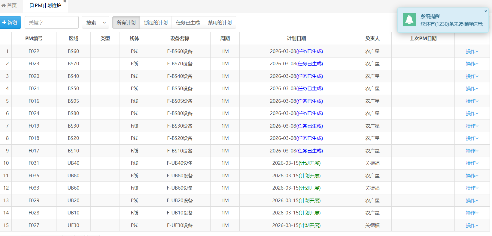
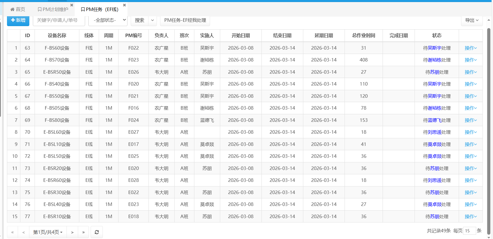
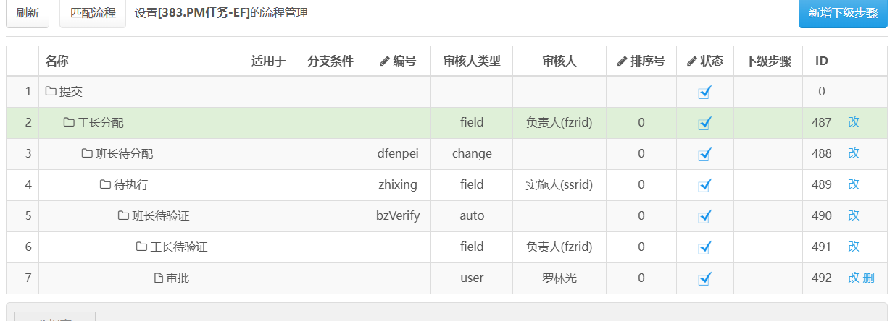
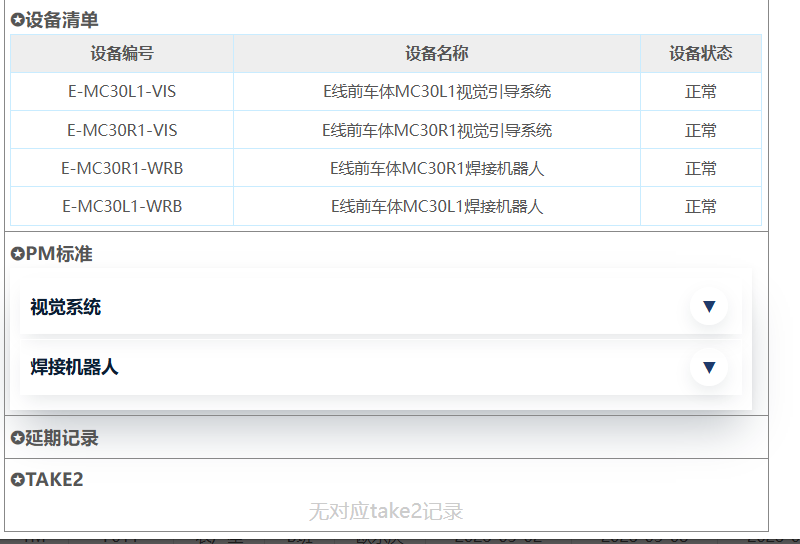

# PM任务流程（新）

> 新模块：EF线当前在用PM流程（以工位推送PM）


基础准备：PM维护计划、PM标准、设备台账。


## 一、PM责任区




## 二、PM维护计划




主要字段为**PM编号**和**计划时间**，**负责人、负责人id（来自于第一步的PM责任区）**和状态**state**（0为未生成，1为任务已生成，2锁定不进行差异化计算,4不生成任务），在图中带有任务已生成状态为1，计划开展为0，还有一个任务异常（状态为0且当天日期大于等于计划日期）


## 三、PM任务生成

1. 当今时间大于等于计划时间时，会生成PM任务（模块名为pmrw）---根据负责人班组命名*班次*，当天时间为开始日期，结束时间、延期时间为一周，根据PM标准计算总作业时间（根据设备台账+pm标准）。

2. 更新PM计划的state为1

3. 为pm任务添加设备维护记录（根据设备台账，保存数据库为pmrwc，关系字段为mmid，**mid为旧pm关系字段**），此时只是创建，没有对应的状态内容


## 四、PM任务流程





1. 工长分配：fzrid来自于pm维护计划，自由选择人员

2. 班长待分配：编辑或者分配选择实施人（ssrid赋值）

3. 待执行：**人员完成之前**（可查看pmrwModel-flowcheckekbefore函数），需要线填写take2；有问题可以填写pm问题

4. 审核人来源于数据表flow_log，改单据id最后编辑或者班长待分配的操作人

5. 工长待分配：fzrid来自于pm维护计划，结束流程

6. 审批：`type` = '备份'的数据给罗林光审核

**流程完成**：1.可查看pmrwModel-flowfinish函数，更新pm任务完成时间为当日；2.更新数据表pmrwc对应关联数据id状态为正常；3.更新对应周期、pm编号的PM计划为下一循环日期；


### 五、PM任务详情页



1. 设备清单：来自于数据表pmrwc。

2. PM标准：来自于数据表pmbz

3. 延期记录：还没用

4. take2：来自数据表take2

```
N0tice：
对于take2数据，可以通过pm问题模块进行改变。(mode_pmwtAction-saveafter函数)，

即pm问题提交的时候，会将数据表pmrwc的设备设为异常；

PM任务流程结束，pmrwc的设备更新为“已修复”；
```


总结：和原来的pm流程有两个不同：

1。pmrwc的mid（原）------>mmid（新）

2。take2的neirid(原)------->xneirid(新)

3。pm任务pmrwid（原）----->xpmrwid(新)

> 以上id均表示pm任务主表id
> 
> take2填写链接在pm任务流程（执行）中（填写ok，展示ok）
> 
> pmwt填写链接在pm任务（填写pm流程-操作单据）中（填写ok，无展示）
> 
> pmrwc内容在pm任务生成时一块产生（流程ok）


#finish on Mar-10 14:35#


