### 运行问题流程

> 本节主要介绍运行问题审核流程

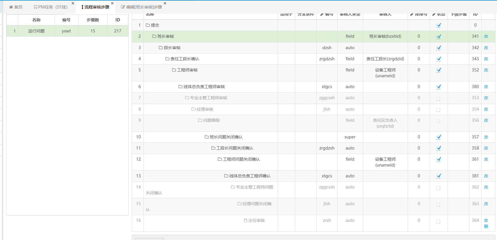

这里看起来有15步，但好些步骤流程已经关闭了。

#### 步骤1：提交，先查看权限

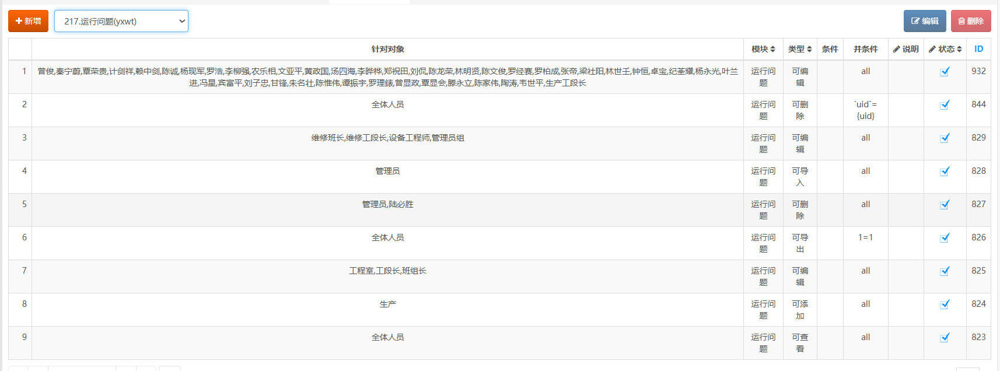

- 对于生产人员（生产班段长），可以直接在页面提交 

- 对于维修需要填写take2后生成运行问题单据，生成后编辑；

#### 步骤2：班长审核,主要是针对维修工,因为生产的班长用系统不多

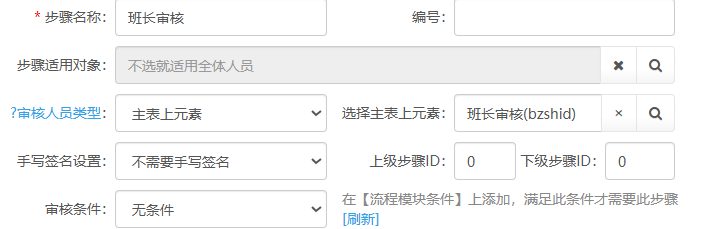

审核人员类型为主表元素，即审核人为主表上的字段；为`gzshid`

来源

默认值为superman，即<mark>根据提交人默认对应班长为自己上级</mark>

#### 步骤3：段长审核，审核条件为“设备问题”，也是针对维修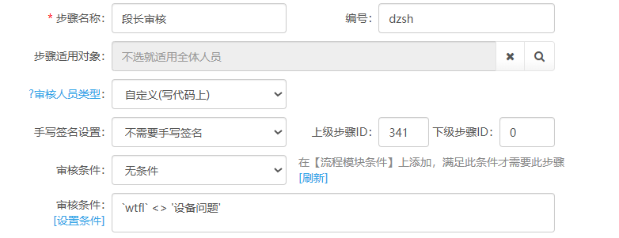

审核人员类型在代码上，就需要去/flow/xxxModel.php(xxx为对应的模块名称)

- 找到方法`flowcheckname($num)`,其中形参`$num`为对应的审核编号，如步骤3为`dzsh`。找到对应的代码，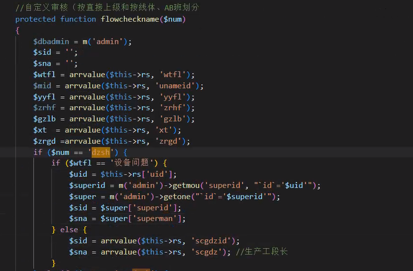

#### 步骤4：责任工段长审核，没有审核条件，即单据只要有`zrgdzid`字段就会进入该步骤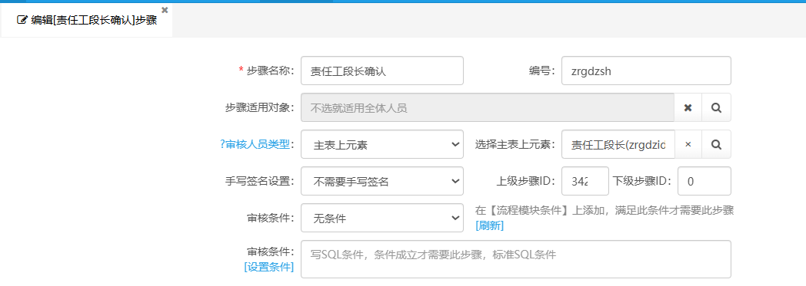

然后可以看到责任工段长为自定义的一个数据源，并且是必填的字段，即<mark>员工录入单据时填写的</mark>，对应的数据源文件在mode_xxxAction(xxx为对应的模块名)

其中，`zrgdzdata`为数据源函数，`zrgdzid`为对应id字段，<mark>对于维修：</mark>

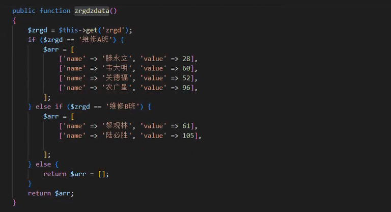

其中数据源形式为`[['name':xxx,'value':xxx]]`为一个键值对数组，`name`为人员的名字，value为保存id；在页面上的表现形式为：

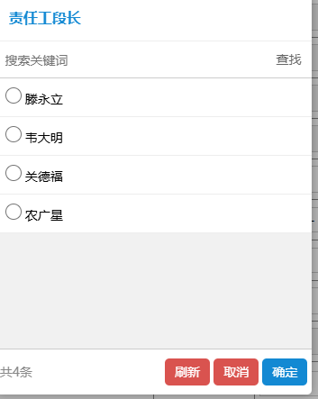

这是最常见的应用，其中键（key）（程序中为name）,在运行问题中对应的字段为`zrgdz`即对应的名字，值(value)（程序中为value），对应字段为`zrgdzid`。

对于<mark>生产</mark>：

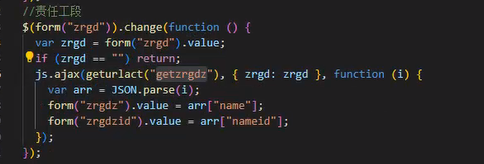

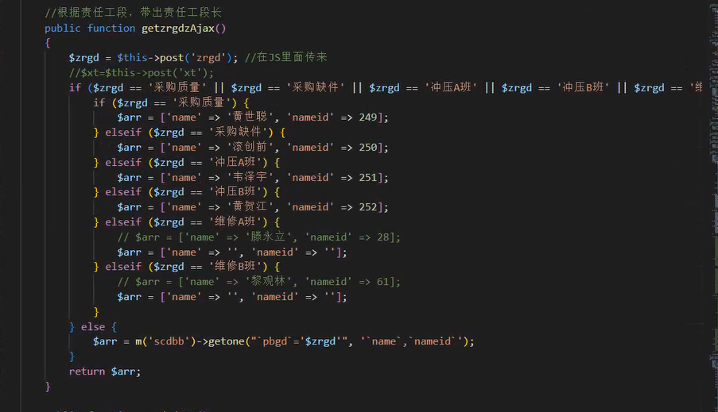

即`zrgd(责任工段)`改变时，不为空则调用`getzrgdzAjax`方法，并改变`zrgdz`和`zrgdzid`的值。

#### 步骤5：工程师审核

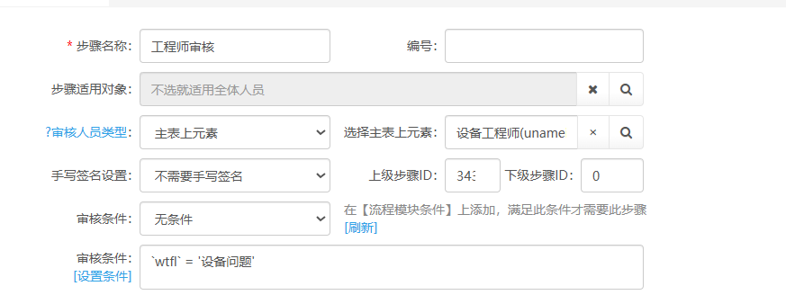

同理，wtlx为设备类型，只针对<mark>维修</mark>，主表字段为uname。

来源：

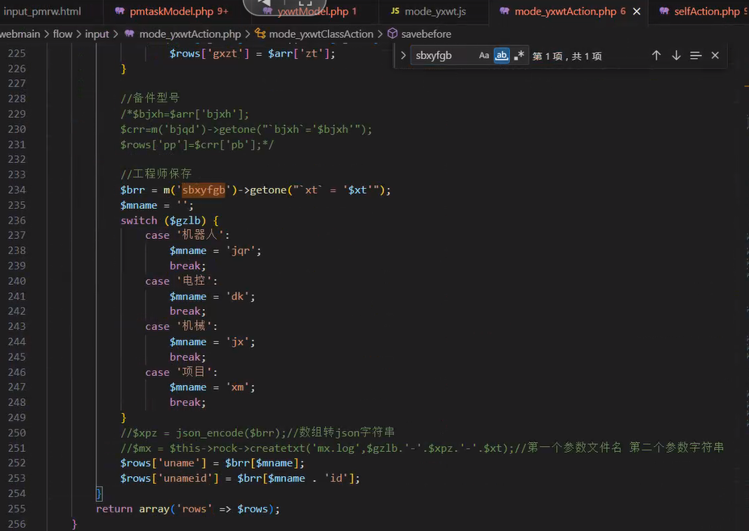

#### 步骤6：线体总负责工程师审核

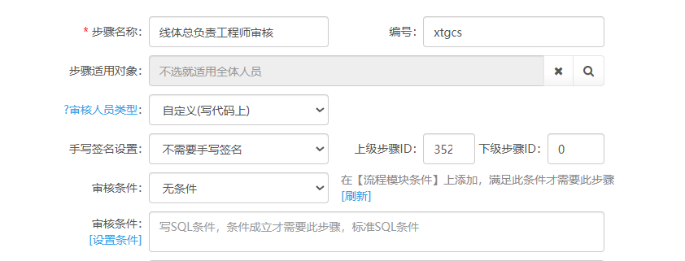

同理，需要找到指定文件对应的方法`flowcheckname($num)`，找到对应编号（`num`=`xtgcs`）

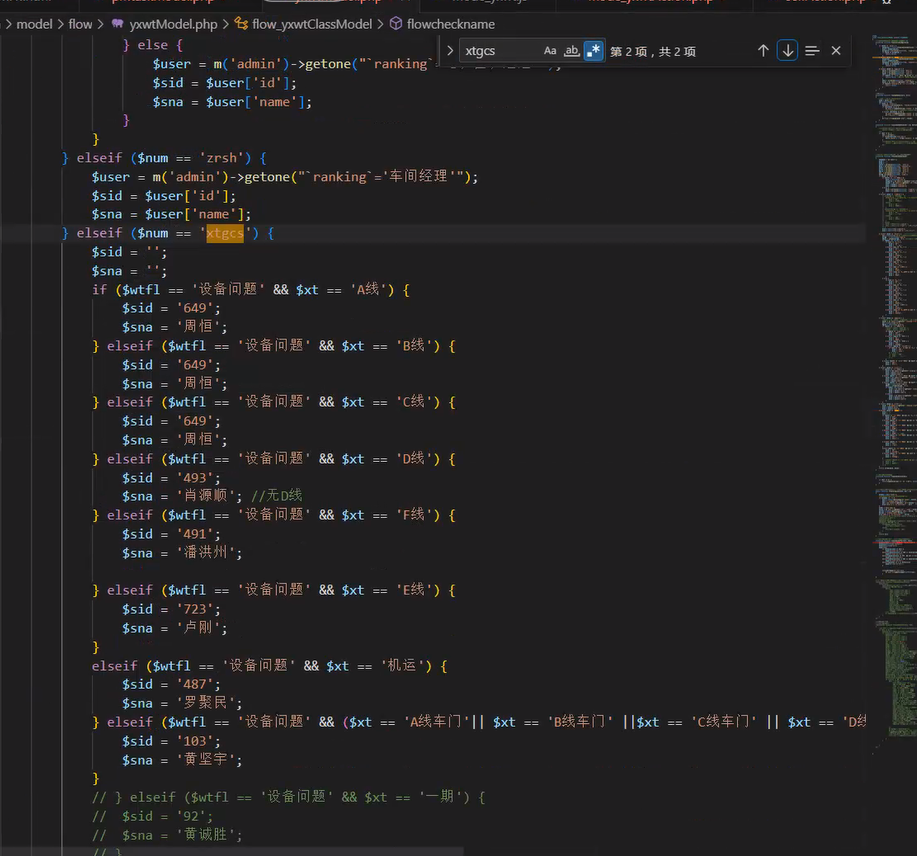

#### 步骤7：班长问题关闭确认

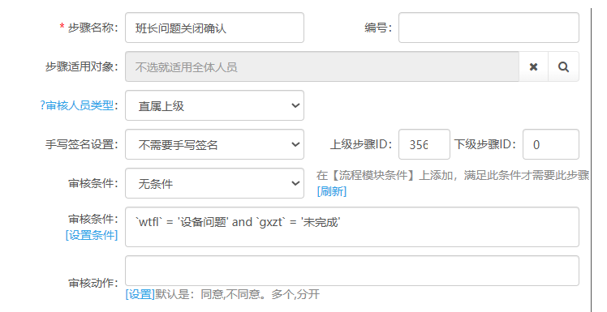

直属上级为提交人的直属上级，<mark>不要和第二个（上次处理的直属上级）搞混</mark>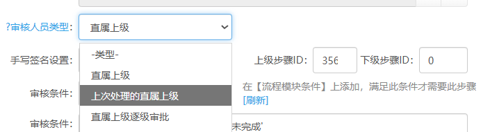

#### 步骤8：工段长问题关闭确认

同理找到文件，………………flowcheckname

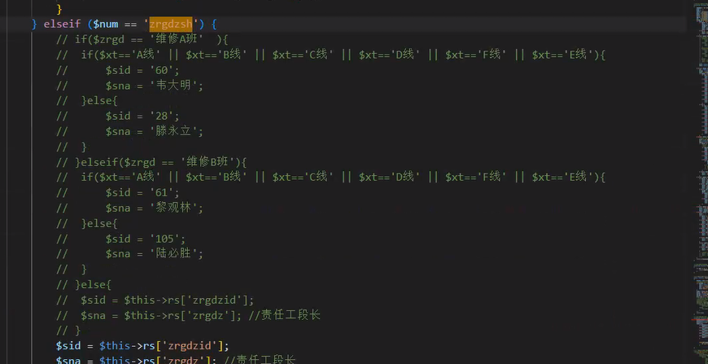

已经太简单了吧，不需要多讲了，多提一嘴`$this->rs`为当前单据数据。

`$this->rs['zrgdz']`为责任工段长字段内容

`$this->rs['zrgdzid']`责任工段长id字段内容

#### 步骤9：工程师问题关闭确认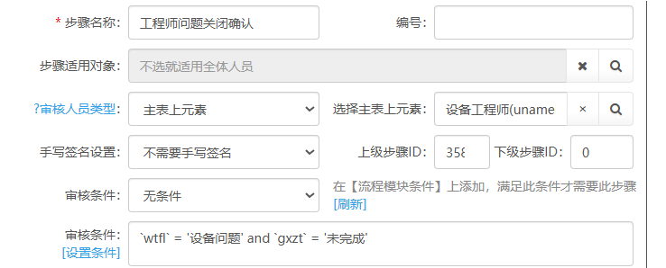

更不必多说了，<mark>联系步骤5</mark>，看到此处还一脸懵逼可以重新开始看了

#### 步骤10：线体总负责工程师确认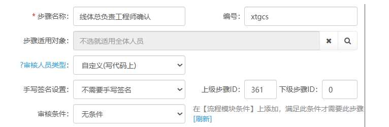

和步骤6一毛一样，一点汤都没换，不用讲了

### 提一嘴

> 之前遇到的问题：连续的审核人就不需要再进行审核

对应的方法位于文件`flow/xxxmodel.php`的`flowcoursejudge`函数中

本例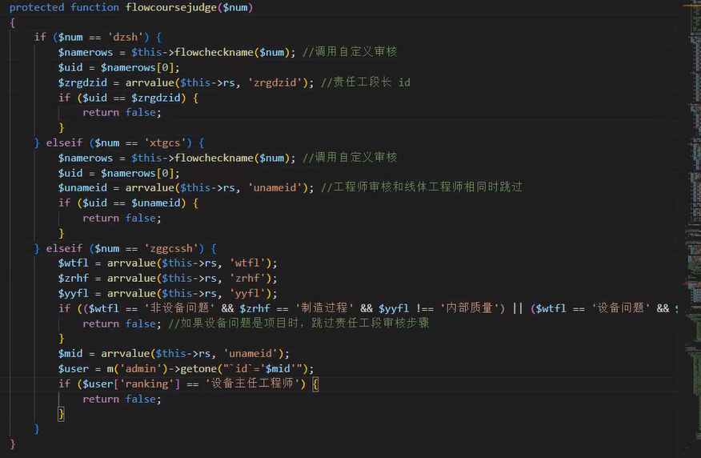

在段长审核中，如果责任工段长审核步骤，参考步骤4，对应的审核元素为：主表元素，也就对应`zrgdzid`，`uid`为当前步骤审核人（步骤3），`zrgdzid`为步骤4审核人，当两者相同，则省略第三部；步骤为xtgcs，zggcssh同理，返回值为`false`即不需要审核。
